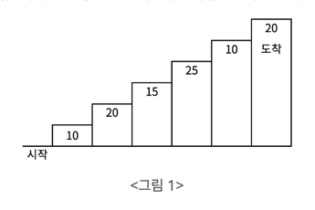
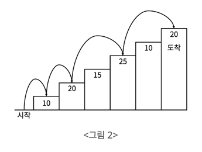

# [계단 오르기](https://www.acmicpc.net/problem/2579)

## 📌 문제
계단 오르기 게임은 계단 아래 시작점부터 계단 꼭대기에 위치한 도착점까지 가는 게임이다. <그림 1>과 같이 각각의 계단에는 일정한 점수가 쓰여 있는데 계단을 밟으면 그 계단에 쓰여 있는 점수를 얻게 된다.

예를 들어 <그림 2>와 같이 시작점에서부터 첫 번째, 두 번째, 네 번째, 여섯 번째 계단을 밟아 도착점에 도달하면 총 점수는 10 + 20 + 25 + 20 = 75점이 된다.

계단 오르는 데는 다음과 같은 규칙이 있다.

1. 계단은 한 번에 한 계단씩 또는 두 계단씩 오를 수 있다. 즉, 한 계단을 밟으면서 이어서 다음 계단이나, 다음 다음 계단으로 오를 수 있다.
2. 연속된 세 개의 계단을 모두 밟아서는 안 된다. 단, 시작점은 계단에 포함되지 않는다.
3. 마지막 도착 계단은 반드시 밟아야 한다.

따라서 첫 번째 계단을 밟고 이어 두 번째 계단이나, 세 번째 계단으로 오를 수 있다. 하지만, 첫 번째 계단을 밟고 이어 네 번째 계단으로 올라가거나, 첫 번째, 두 번째, 세 번째 계단을 연속해서 모두 밟을 수는 없다.

각 계단에 쓰여 있는 점수가 주어질 때 이 게임에서 얻을 수 있는 총 점수의 최댓값을 구하는 프로그램을 작성하시오.

### 입력
입력의 첫째 줄에 계단의 개수가 주어진다.

둘째 줄부터 한 줄에 하나씩 제일 아래에 놓인 계단부터 순서대로 각 계단에 쓰여 있는 점수가 주어진다. 계단의 개수는 300이하의 자연수이고, 계단에 쓰여 있는 점수는 10,000이하의 자연수이다.

### 출력
첫째 줄에 계단 오르기 게임에서 얻을 수 있는 총 점수의 최댓값을 출력한다.

### 예제 입력 1

     6
     10
     20
     15
     25
     10
     20

### 예제 출력 1

     75

### 🧰 풀이 과정

동적 계획법(DP)을 사용하여 해결

1. 상태 정의
   - memo[i]: i번째 계단까지 올랐을 때 얻을 수 있는 최대 점수
   - scores[i]: i번째 계단의 점수

2. 초기값 설정
   - memo[1] = scores[1]
   - memo[2] = scores[1] + scores[2]
   - memo[3] = max(scores[1], scores[2]) + scores[3]
   - 3개 연속으로 밟을 수 없으니, 3개까지는 특별한 case임을 인지

3. 점화식 도출
   - i번째 계단에 도달하는 방법은 두 가지 case
      1. (i-2)번째 계단에서 2칸 점프: memo[i-2] + scores[i]
      2. (i-3)번째 계단에서 1칸 점프 후 현재 계단: memo[i-3] + scores[i-1] + scores[i]
   
   - 따라서 memo[i] = max(memo[i-2] + scores[i], memo[i-3] + scores[i-1] + scores[i])

4. Bottom-up 방식으로 구현
   - 4부터 N까지 반복하며 점화식 적용
   - 결과는 memo[N]에 저장 (계단 번호와 인덱스 일치시킴)

### 시간복잡도와 공간복잡도

      
      시간복잡도: O(N)
         - N개의 계단에 대해 각각 한 번씩만 계산
         - 각 계산에서 수행되는 연산(max 비교와 덧셈)은 O(1)
         - 따라서 전체 시간복잡도는 O(N)
      
      공간복잡도: O(N)
         - scores 배열: O(N)
         - memo 배열: O(N)
         - 기타 변수(N, StringBuilder 등): O(1)
         - 따라서 전체 공간복잡도는 O(N)

### ✨ 새롭게 배운 점
1. DP 문제 해결 전략
   - 연속된 제약 조건이 있는 경우의 DP 설계 방법
   - 마지막 상태(계단)를 반드시 포함해야 하는 경우의 처리
   - 초기값 설정의 중요성과 그 근거

2. 문제 제약 조건 분석
   - "연속 3계단 불가" 조건의 DP 반영
   - 필수 조건("마지막 계단 필수")을 점화식에 반영

